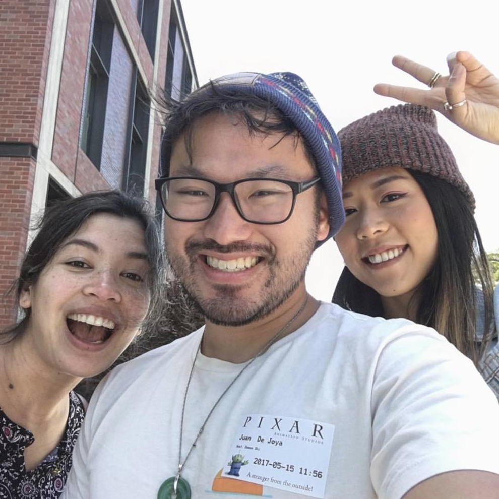

# WebGL 2.0 Masterclass
Web3D 2017 - http://web3d2017.org/

**Date & Time:** 09:15 - 10:45, 6 June, 2017 
**Location:** Classroom G-P504

WebGL 2.0 has landed, and the future of graphics on the web is here. In this workshop, we will introduce the rendering specification for browsers. New features in WebGL 2.0 include geometry instancing, transform feedback, and 3D textures will be covered in depth. Topics will be drawn from arts, science, data visualisation, as well as WebVR/WebAR.

## Course Presenters

<table>
  <tbody>
    <tr>
      <td></td>
      <td></td>
      <td></td>
    </tr>
    <tr>
      <td><strong>Xavier Ho</strong></td>
      <td><strong>Juan Miguel de Joya</strong></td>
      <td><strong>Tomasz Bednarz</strong></td>
    </tr>
    <tr>
      <td>The University of Sydney CSIRO</td>
      <td>DigitalFish Google Spotlight Stories</td>
      <td>UNSW University CSIRO</td>
    </tr>
  </tbody>
</table>

## Link to slides
The slides are accessible in [Google Slides](https://docs.google.com/presentation/d/15_yBo_U4n_J54Q-PnpYYejnwk5xDak_Bbd-BMjo7UFU/edit#slide=id.g209618ea61_0_6).

## Resources
 * [WebGL 2.0 Specification](https://www.khronos.org/registry/webgl/specs/latest/2.0/)