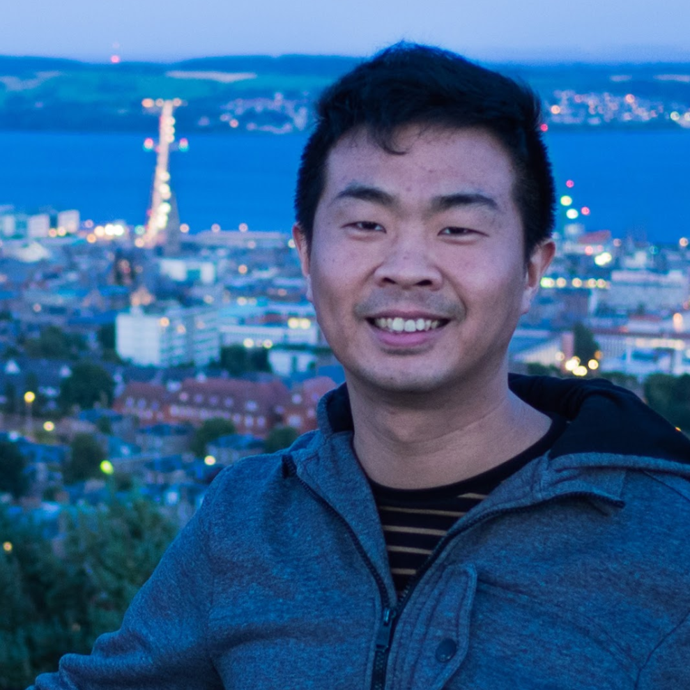

# WebGL 2.0 Masterclass
Web3D 2017 - http://web3d2017.org/

## Course Presenters

<table>
  <tbody>
    <tr>
      <td></td>
      <td></td>
      <td></td>
    </tr>
    <tr>
      <td><strong>Xavier Ho</strong></td>
      <td><strong>Juan Miguel de Joya</strong></td>
      <td><strong>Tomasz Bednarz</strong></td>
    </tr>
    <tr>
      <td>The University of Sydney CSIRO</td>
      <td>DigitalFish Google Spotlight Stories</td>
      <td>UNSW University CSIRO</td>
    </tr>
  </tbody>
</table>
